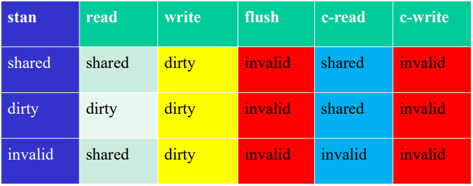
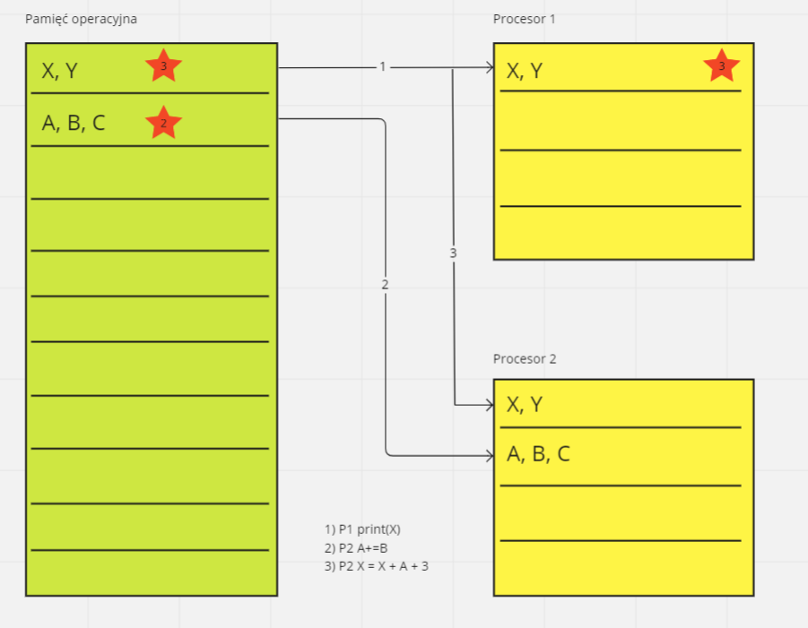
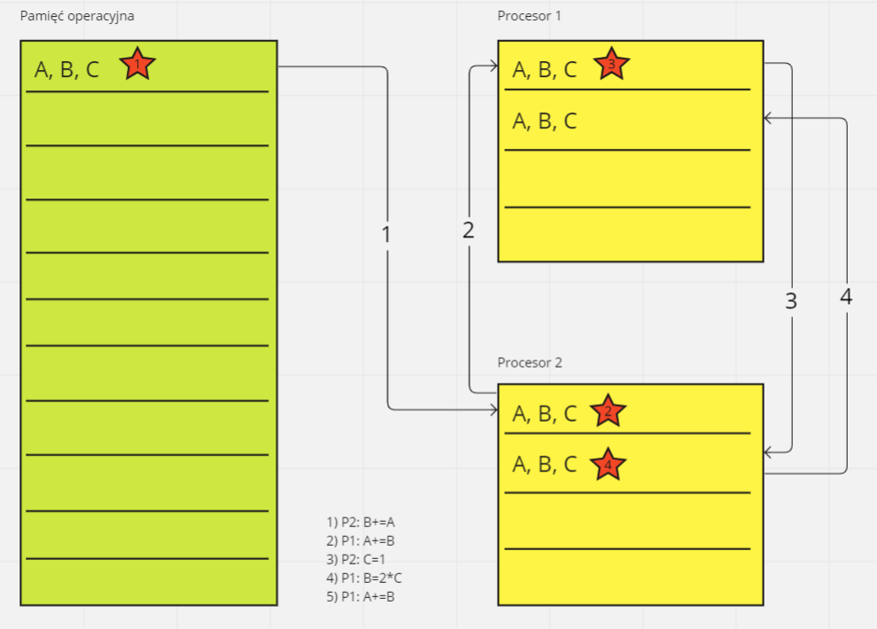

# Zadanie z unieważnieniam

 \
*Zadanie 1.1*

Zadanie dotyczy zachowania się linii pamięci w przypadku zastosowania protokołu unieważnienia.

## Wstęp teoretyczny

Większość komputerów osobistych posiada tylko jeden procesor, który ma wiele rdzeni. 
Te rdzenie posiadają własną pamięć podręczną (cache) o różnych poziomach. 
Oznaczamy je: L1, L2, L3, L4, ...

W każdym nowszym procesorze buduje się przynajmniej jeden poziom cache, który jest wspóldzielony na wszystkie rdzenie, dlatego znajdziemy co najmniej dwa poziomy pamięci podręcznej. 
Rzadko kiedy jest więcej poziomów niż 4, a każdy ,,wyższy'' poziom posiada wolniejszy czas dostępu. 
Na pytanie ,,Dlaczego?'' najprościej jest odpowiedzieć: ,,Bo pamięć L1 jest najbliżej procesora''.

 \

Cache można zarządzać na różne sposoby. Pamięć L1 jest jest zazwyczaj bardzo ograniczona. Najnowszy procesor Intel Core i5 w momencie pisania tego dokumentu Intel Core i5-12600H ma 1.1MB, co robi wrażenie w porówaniu do np. Intel Core i5-6500, który ma tylko 128 KB.

Największym problemem przy dużych przetwarzaniach zazwyczaj jest właśnie oczekiwanie na dostęp do pamięci. W przetwarzaniu równoległem najważniejszą rzeczą jest zapewnić to, że dostęp do jakiegoś adresu pamięci będzie zawsze zwracać aktualne dane tzn. nie ważne gdzie obecnie znajdują się dane: czy w pamięci podręcznej rdzenia nr 2. czy nr. 3, czy w współdzielonej cache, czy w pamięci RAM, czy na dysku w pamięci SWAP, to i tak otrzymamy aktualne dane.

W celu zapewnienia spójności pamięci w rdzeniach (pamięć podręczna procesora) w systemach wieloprocesorowych stworzone zostały odpowiednie protokoły. Zapewniają one istnienie szeregowego porządku wykonania instrukcji realizowanych równolegle. Chodzi o to, żeby programy miały taki sam rezultat, jak gdyby nie były uruchomione równolegle, tylko na jednym rdzeniu (i jednym wątku). Inaczej ciężko w ogóle mówić, że program jest poprawny. Jeżeli linie nie byłby spójne, to dwa wątki mogłyby widzieć różne dane i wynik programu zależałby od szczęścia. Takie zjawisko nazywa się wyścigiem i w programowaniu równoległym dążymy do elminacji wszystkich wyścigów, więc nie może go być także na poziomie pamięci.

Takie dwa najważniejsze protokoły, które rozwiązują ten problem to:
### Protokół uaktualnienia
Każdy rdzeń, który wprowadza sobie jakieś zmiany, wymusza na pozostałych rdzeniach, żeby pobrały te zmiany od niego. Oczywiście dane są pobierane, tylko jeżeli są potrzebne. Każdy wpis z danymi ma specjalny bit ,,potrzebności'', jeżeli jest ustawiony na 1 to dane będą pobrane. Ten protokół nie uaktualnia danych w RAM/dysku/pamięci współdzielonej cache, tylko w prywatnych pamięciach podręcznych. Nie trzeba być jakoś specjalnie błyskotliwym, żeby zobaczyć, że to rozwiązanie jest do kitu. Wymaga wielu przerwań i przesyłu danych. Rdzeń może zmienić te dane jeszcze 4 razy, zanim drugi będzie go potrzebować. To są 3 bezsensowne przesyły danych. Ostatni przesył ma trochę sensu, ale tylko trochę, bo jak jest więcej rdzeni, to tylko jeden potrzebuje tych danych (w danym momencie, bo kiedyś one chcą je otrzymać, skoro mają ustawiony bit potrzebności). A i tak za chwilę je zmieni i znowu będzie musiał przesyłać.

### Protokół unieważniania
Walkoś razej zapyta o ten protokól, bo jest bardziej skomplikowany. Tutaj linie posiadają zarezerowane dwa bity zabrudzenia, które opisują możliwe stany pamięci. Każdy zapis danych powoduje ustawienie tych bitów w innych pamięciach podręcznych na unieważniony (invalid), lecz nie wymusza kopiowania ich przetwarzania ze względu na oczekiwanie na dane unieważnione przy żądaniu dostępu do tych danych. Częściej stosowany obecnie ze względu na duże znaczenie przepustowości pamięci i magistrali (ten protokół obniża wymagania na przepustowość, może też obniżać prędkość przetwarzania wątku).

## Protokół unieważniania - opis stanów

Inna nazwa dla tego protokołu to protokół MSI (jeśli ktoś woli angielskie źródła, nazwa pochodzi od nazw stanów: Modified, Shared, Invalid. Ze względu na wydajność, w praktyce używa się częściej protokołu MESI z dodatkowym stanem Exclusive). Poniżej znajdują się diagramy, których zrozumienie jest niezbędne do poprawnego wykonania zadania.

Na Invalid nie robi się c_read (w tabeli stanów niby jest, ale na pierwszym grafie Walkowiaka nie ma. Ta sytuacja to jest cache miss: inny proces próbuje od nas odczytać coś, ale my tego nie mamy).

Ten sam graf z innej prespektywy:

To co jest w grafie wyżej opisane jako c_write, jest tak naprawdę operacją write dowolnego innego procesora wykonującego dostęp do tej samej pamięci (prawa strona diagramu). Na tym diagramie brakuje wpływu read dowolnego innego procesora wykonującego dostęp do tej samem pamięci. Nie pamiętam, czy Walkowiak to mówił, ale próba odczytu pamięci, która jest dirty, powoduje flusha i to zapisuje pamięć podręczną do pamięci operacyjnej, dlatego wtedy oba rdzenie mają pamięć w stanie shared (linie pp w tym stanie można bezpiecznie usunąć bez konieczności flusha). Narysowanie tej sytuacji kompilkuje graf:
>todo: opis tego diagramu, dodanie diagramu z uwzględnionym c_read

W formie tabeli:

 \
*rys. 2*

Mamy 3 główne stany w któch może znajdować się dana linia pamięci. Są to:
* Shared - współdzielony - oznacza to, że ta sama linia może być współdzielona przez inne procesy. 
* Invalid - unieważniony - oznacza, że dana linia została unieważniona po akcji innego procesu. W celu dalszego przetwarzania musi zostać pobrany z pamięci.
* Dirty - brudny - stan świadczący o tym, że lokalnie posiadana linia została nadpisana.

Operacje które można wykonywać na liniach pamięci:
* read - odczyt
* write - zapis
* flush - zrzut / zapis do pamięci operacyjnej

Na rysunkach mamy widoczne operacje:
* read / write - lokalny odczyt / zapis, 
* c-read / c-write - odczyt / zapis kopii danej linii pamięci przez inny procesor
* flush - zrzut linii pamieci do pamięci operacyjnej

Analiza zachowania się danej linii pamięci w stanie **invalid** z perspektywy procesora P1 (rys. 2).
* Jeśli P1 odczyta tą linie
    * P1:
        * invalid -> shared
    * Inne procesy:
        * shared -> shared
        * dirty -> shared
        * invalid -> invalid
* Jeśli P1 zapisze dane do linii
    * P1:
        * invalid -> dirty
    * Inne procesy:
        * shared -> invalid
        * dirty -> invalid
        * invalid -> invalid
* Jeśli P1 zrobi zrzut pamięci - wszystkie kopie linii są w stanie invalid

Można zauważyć pewne prawidłowości, które ułatwiają zapamiętania zasad algorytmu MSI.
* Po lokalnym zapisie linia zawsze przechodzi w stan dirty ORAZ unieważnia się wszystkie pozostałe linie (stan invalid).
* Po flush wszystkie kopie danej linii stają się invalid.
* Jeśli dana kopia linii jest w stanie invalid, to jedynym sposobem na prace z nią jest ponowne pobranie jej. To następuje podczas operacji read, dzięki czemu mamy invalid -> shared. Nie należy zapomnieć o zapisie zmieniającym linie w stan dirty!

Zatem należy zrozumieć i zapamiętać jedynie 2 kolumny, mianowicie kolumne read, oraz c-read.

## Protokół unieważniania - zdarzenia

Skróty:
* PPP1 - pamięć podręczna procesora 1
* PO - pamięć operacyjna

Mamy 5 różnych zdarzeń
* T - trafienie - przypadek w którym potrzebne dane są w pamięci podręcznej procesora
* BT - brak trafienia - przeciwieństwo trafienia
* D - dostępy - jest to po prostu T + BT
* P - pobranie - chodzi o pobranie linii z pamięci podręcznej (danego procesora lub operacyjnej)
* Un(x) - unieważnienie - zmienna x w tym przypadku określa które linie pamięci zostały unieważnione (np. linia procesora 1, lub linia z pamięci operacyjnej)

Zakładając, że linie pamieci można pobierać zarówno z PO, jak i PP drugiego procesora, rozważmy przykład

 \
*rys. 3*

1) P1: print(X)
2) P2: A+=B
3) P2: X = X + A + 3

Początkowo wszystkie PP procesorów są puste, linie w PO są w stanie dirty.
* Operacja 1 - Procesor P1 chce wyświetlić zmienną X. Początkowo nie posiada żadnych danych, dlatego próba pobrania linii ze zmienną X z pamięci podręcznej kończy się brakiem trafienia. Dane te należy pobrać. Mamy zatem
    * 1BT , 1D , 1P , 0Un
* Operacja 2 - Procesor P2 chce nadpisać dane znajdujące się z zmiennej A. W tym celu podobnie jak w poprzednim podpunkcie następuje 1 BT, oraz 1 P. Po pobraniu linii pamięci pobiera się również zmienną B, przez co następuje trafienie. Pamiętać należy, że operacja ta wykorzystuje dwa razy zmienną A (ponieważ A=A+B). Dlatego też, przy okazji drugiego dostępu również mamy trafienie. Przez dokonanie zapisu następuje unieważnienie kopii tejże linii w pamięci operacyjnej). Czyli:
    * 1BT , 3D , 1P , Un(PO)
* Operacja 3 - Procesor P2 pobiera linię ze zmieną X. Zmienna A jest już w pamieci podręcznej. Przez modyfikację zmiennej X, następuje unieważnienie jej zarówno w PPP1, jak i w PO.
    * 1BT , 3D , 1P , Un(PO, PPP1)

## Rozwiązanie zadania 1.1

Na potrzeby tumaczenia przyjmijmy, że ponowne pobranie tej samej linii zapisujemy na następnej wolnej pozycji. Czerwona gwazda na rysunku 4 określa unieważnienie linii PP w danym kroku.

 \
*rys. 4*

* Stan początkowy - występuje jedna linia pamięci w PO, jest ona w stanie dirty i znajdują się na niej zmienne A, B, C (jak wynika z treści zadania).
* W pierwszym kroku wymagane jest pobranie linii z PO do PPP2, ponieważ danych tych tam nie było. Z uwagi na to, że operacja B+=A jest tym samym co B=B+A - mamy do czynienia z 3 dostępami. Brak trafienia występuje jedynie w przypadku sprawdzenia pierwszej zmiennej, ponieważ przy okazji pobramia linii, przy okazji pobieramy potrzebne dane dla następnych trafień (sytacja została wyjaściona we wcześniejszym rozdziale). Z uwagi na wykonany zapis linia znajdująca się w PPP2 przechodzi w stan dirty, a ta z PO jest invalid (następuje unieważnienie). Mamy zatem
    * 1BT , 3D
    * Labc(PO) = invalid, Labc(PPP2) = dirty

* W drugim kroku przepisujemy linię z PPP2 do PPP1. Procesor 2 wykonuje zapis, zatem unieważnia to linię z P1.
    * 1BT , 3D
    * Labc(PPP2, PO) = invalid, Labc(PPP1) = dirty

* Kolejny krok niestety wymaga ponownego sprowadzenia do P2 linii w celu zapisu nowej wartości do zmiennej C. Operacja wymaga użycia tylko jednej zmiennej, dlatego występuje 1 dostęp.
    * 1BT , 1D
    * Labc(PPP1, PO) = invalid, Labc(PPP2) = dirty

* Krok tożsamy z krokiem drugim. Z tą różnicą, że korzystamy z 2 zmiennych.
    * 1BT , 2D
    * Labc(PPP2, PO) = invalid, Labc(PPP1) = dirty

* W ostatnim kroku nie ma żadnych unieważnień, ponieważ wszystkie dane wymagane do przeprowadzenia zapisu są w PPP1. W stanach linii PP również nic się nie zmienia.
    * 0BT, 3D
    * Labc(PPP2, PO) = invalid, Labc(PPP1) = dirty (ostateczny stan)

Zadanie pod względem dydaktycznym nie jest wyczerpujące, nakreśla jedynie intuicję. Polecam przejrzeć inne zadania, gdzie korzysta się z większej ilości linii pamięci (min. 2). Przykładowe zadania, jak i odpowiedzi do nich znajdują się w odpowiedniej paczce.

> todo przygotować paczkę
