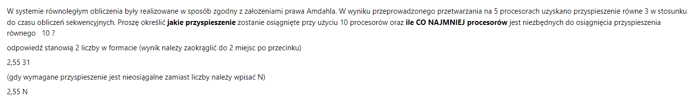
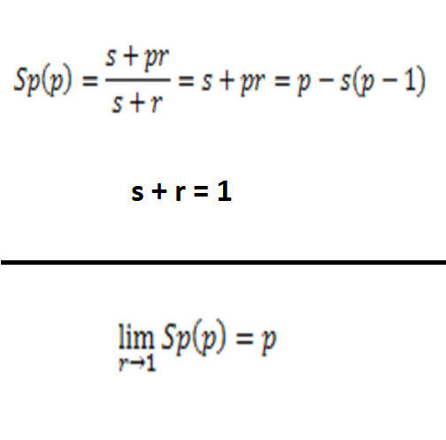

# Zadanie liczenie efektywności algorytmów

Zadanie dotyczy użycia wzorów na oszacowanie przyspieszenia oraz efektywności programu równoległego przy użyciu danej liczby procesorów.

\
*zad 2*

## Wstęp teoretyczny
* prawo Amdahla - jest używane do znajdowania maksymalnego spodziewanego zwiększenia wydajności wraz ze wzrostem ilości uzytych procesorów. Ważne jest rozdzielenie procentowego udziału części sekwencyjnej **s**, oraz równoległej **r** kodu. Dodawanie procesorów będzie przyśpieszać program, ale część programu i tak musi być wykonywana sekwencyjnie tzn. ,,na wyłączność''. Np. często trzeba uzyskać dostęp do pamięci z pewnością, że nikt z niej nie odczyta ani do niej nie napisze. Jeżeli przyśpieszymy nasz program do granic możliwości, to i tak wszystkie procesory będą w pewnym momencie musiały czekać, aż ten co musiał wziąć dane na wyłączność zakończy swoją pracę. Taka praca, której nie da się przyśpieszyć nazywana jest właśnie częścią sekwencyjną **s** kodu.

> Rozpatruje się dowolne instancje o stałym rozmiarze.

*rys 2.1*

## Wzory
\
*rys 2.2*

* f(x) - fukcja przyspieszenia
* x - ilość procesorów

### Efektywność liczy się za pomocą wzoru\
**Ep = Sp / p**

Warto zauważyć, że 
* gdy ilość procesorów rośnie do nieskończoności, wpływ części równoległej dąży do zera. Oznacza to, że wraz ze wzrostem procesorów zmniejszają się korzyści płynące z ich użycia. W praktyce występują różnego rodzaju opóźnienia wynikające z komunikacji procesorów - ma to wpływ na czas wykonania programu. Wniosek jest tak, że warto zwiększać ilość procesorów tylko do pewnego momentu, ponieważ te przestają mieć wpływ na przyspieszenie programu. Jest ono ograniczone od góry!
* gdy część równoległa dąży do jedynki, przyspieszenie jest równa **p**. Oznacza to, że występuje idealne zrównoleglenie - wpływ części sekwencyjnej jest pomijalny. Można to interpretować tak, że każdy procesor zajmuje się w całości "swoją częścią" danego zadania (nie czeka na żadne dane, nie ma opóźnień w komunikacji). Ta sytuacja w praktyce raczej nie jest zauważalna, jednakże czysto hipotetycznie możliwa. Efektywność w tej sytuacji jest równa 1 (maksymalna wartość).

> Przyspieszenie możliwe do osiągnięcia jest ograniczone. Nie można w nieskończoność zwiększać przyspieszenia. \ 
Czym większy procent części rónoległej, tym granica przyspieszenia jest później.

* prawo Gustafsona - stanowi, że każdy wystarczająco duży problem może być efektywnie zrównoleglony. W odróżnieniu do prawa Amdahla, to jest skalowalne. Prawo Gustafsona pozwala na analize rosnącej instancji rozważanego problemu. Dobierana jest ilość procesorów w taki sposób, aby przyspieszenie **rosło liniowo** wraz ze wzrostem problemu. 

> Rozpatruje się przetwarzanie szeregu instancji problemu o rosnącym rozmiarze i stałym czasie przetwarzania równoległego.

\
*rys 2.3*

---

## Zadanie - prawo Amdahla
Wzory z którego należy skorzystać zostały podane na rysunku 2.1, za ich pomocą należy utworzyć prosty układ równiań.

### Dane
* ilość procesorów = **p** = 5 
* przyśpieszenie = **Sp** = 3

### Obliczenia
* 3 = 1 / (s + (1-s)/5)
* s = 1/6
* r = 5/6

Mając **s** oraz **r** można teraz obliczyć dalszą część, czyli \
a) jakie przyspiszenie zostanie osiągnięte przy użyciu 10 procesorów \
b) ile conajmniej jest potrzebne procesotów do osiągnięcia przyspieszenia Sp = 10.

* Sp = 1 / `(`1/6 + (`(`5/6`)` / 10)`)` = 1 / `(`1/6 + 5/60`)` = 1 / (15/60) = **4**

Odp.: Przy zastosowaniu 10 procesorów przyspieszenie byłoby równe **4**.

* 10 = 1 / `(` 1/6 + (5/6 / x) `)` --> x = **-12.5**

Odp.: Wynik jest ujemny, mamy zatem sprzeczność. Nie jest możliwy taka ilość procesorów, aby przyspieszenie było conajmniej równe **10**.

---
## Zadanie - inny wariant

x = 20%
s = x / (x + (1-x)*p)

Pozostałe obliczenia tak samo jak wcześniej.

---

W zadaniu liczy się czas, oraz drobne błędy kosztują stosunkowo dużo, dlatego też polecam zacząć od wyznaczenia sobie wzorów, żeby ostatecznie nie pomieszać się w ułamkach.

## $Sp = {1 \over {s + {r \over p}}}$
## $s = {p - Sp \over {(p-1) \times Sp}}$
## $p = {r \times Sp \over {1 - s \times Sp}}$

Warto zauważyć że przy ostatnim wzorze na $p$ jedyną opcją, żeby liczba ta była ujemna jest ujemny mianownik. Natomiast aby to osiągnąć wyrażenie *$s \times Sp$* powinno być większe lub równe 1 (pod każdą zmienną kryje się dodatnia wartość).

## check if
## $s \times Sp \ge 1$
## then
## return false